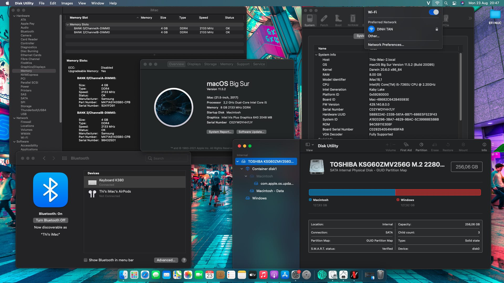

#Asrock H310 _ i5-9400f _ rx570 Hackintosh with OpenCore

-   macOS version: **Big Sur** **11.5.2**

## Overview

 
<strong>macOS Big Sur</strong>

 

## Hardware Specifications

|     Category      |                                                         Detail                                                          |
| :---------------: | :---------------------------------------------------------------------------------------------------------------------: |
|        CPU        |                                              i5 7260U 2.2GHz up to 3.4 GHz                                              |
|       IGPU        |                                                 Intel® UHD Graphics 640                                                 |
|      Memory       |                                                      8GB DDR4-2133                                                      |
|      Drives       |                                                   Toshiba 256 M2 SATA                                                   |
| Network interface |                                         Intel® Wireless-AC 8265 + Bluetooth 4.2                                         |
|  External ports   | Thunderbolt 3 (40Gbps) USB 3.1 Gen 2 (10Gbps) and DP 1.2 via USB-C; also includes microSDXC card slot, dual microphones |

More https://ark.intel.com/content/www/us/en/ark/products/95061/intel-nuc-kit-nuc7i5bnk.html

## Note

-   Generate your own MLB, SystemSerialNumber, SystemUUID (https://dortania.github.io/OpenCore-Install-Guide/config-laptop.plist/kaby-lake.html#platforminfo)
-   Use the Proper Tree and GenMSBIOS to edit the Generic in the Platforminfo section :D
